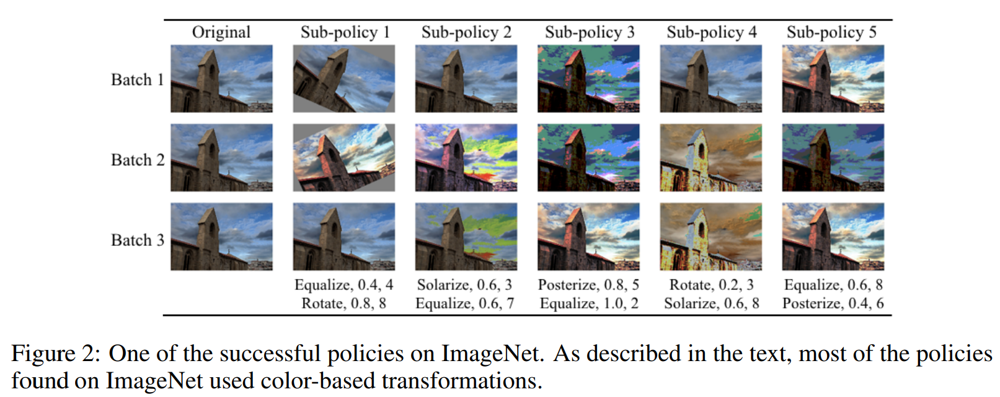

# AutoAugment - Learning Augmentation Policies from Data
Unofficial implementation of the ImageNet, CIFAR10 and SVHN Augmentation Policies learned by [AutoAugment](https://arxiv.org/abs/1805.09501v1), described in this [Google AI Blogpost](https://ai.googleblog.com/2018/06/improving-deep-learning-performance.html).




------------------


## Example

```python
from autoaugment import ImageNetPolicy
image = PIL.Image.open(path)
policy = ImageNetPolicy()
transformed = policy(image)
```


## Example as a PyTorch Transform - ImageNet 

```python
from autoaugment import ImageNetPolicy
data = ImageFolder(rootdir, transform=transforms.Compose(
                        [transforms.Resize(256), transforms.RandomResizedCrop(224), 
                         transforms.RandomHorizontalFlip(), ImageNetPolicy(), 
			 transforms.ToTensor(), transforms.Normalize(...)]))
loader = DataLoader(data, ...)
```

From the paper it is not clear in what exact order to apply the preprocessing for ImageNet:

> For baseline augmentation, we use the standard Inception-style pre-processing which involves scaling pixel values to [-1,1],
> horizontal flips with 50% probability, and random distortions of colors. For models trained with AutoAugment, we use the baseline pre-processing
> and the policy learned on ImageNet. We find that removing the random distortions of color does not change the results for AutoAugment.

## Example as a PyTorch Transform - CIFAR10

```python
from autoaugment import CIFAR10Policy
data = ImageFolder(rootdir, transform=transforms.Compose(
                        [transforms.RandomCrop(32, padding=4, fill=128), # gray fill value is important bc of the color operations
                         transforms.RandomHorizontalFlip(), CIFAR10Policy(), 
			 transforms.ToTensor(), 
                         Cutout(n_holes=1, length=16), # (https://github.com/uoguelph-mlrg/Cutout/blob/master/util/cutout.py)
                         transforms.Normalize(...)]))
loader = DataLoader(data, ...)
```

## Example as a PyTorch Transform - SVHN

```python
from autoaugment import SVHNPolicy
data = ImageFolder(rootdir, transform=transforms.Compose(
                        [SVHNPolicy(), 
			 transforms.ToTensor(), 
                         Cutout(n_holes=1, length=20), # (https://github.com/uoguelph-mlrg/Cutout/blob/master/util/cutout.py)
                         transforms.Normalize(...)]))
loader = DataLoader(data, ...)
```

------------------


## Results with AutoAugment

### Generalizable Data Augmentations

> Finally, we show that policies found on one task can generalize well across different models and datasets. 
> For example, the policy found on ImageNet leads to significant improvements on a variety of FGVC datasets. Even on datasets for
> which fine-tuning weights pre-trained on ImageNet does not help significantly [26], e.g. Stanford
> Cars [27] and FGVC Aircraft [28], training with the ImageNet policy reduces test set error by 1.16%
> and 1.76%, respectively. __This result suggests that transferring data augmentation policies offers an
> alternative method for transfer learning__.

### CIFAR 10


### CIFAR 100


### ImageNet


### SVHN


### Fine Grained Visual Classification Datasets


### Open questions
How can you set the pixel values after rotating to gray instead of black?

#### Shear function adapted from [Augmentor](https://github.com/mdbloice/Augmentor/blob/master/Augmentor/Operations.py)
